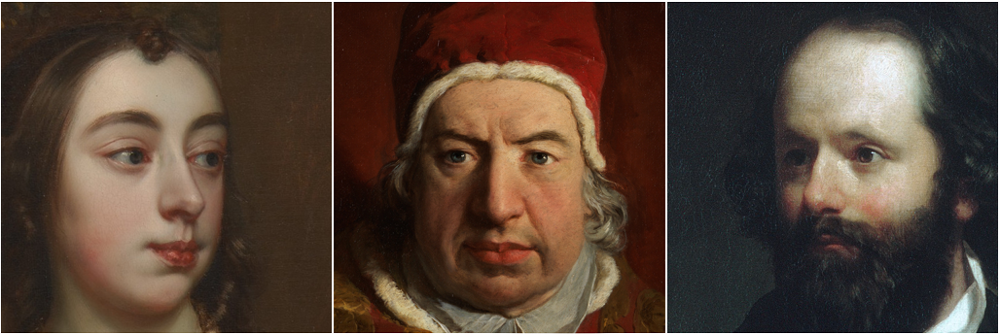

## MetFaces Dataset



MetFaces is an image dataset of human faces extracted from works of art, originally created as part of our work on:

> **Training Generative Adversarial Networks with Limited Data**<br>
> Tero Karras (NVIDIA), Miika Aittala (NVIDIA), Janne Hellsten (NVIDIA), Samuli Laine (NVIDIA), Jaakko Lehtinen (NVIDIA and Aalto University), Timo Aila (NVIDIA)<br>
> https://arxiv.org/abs/2006.06676

The dataset consists of 1336 high-quality PNG images at 1024&times;1024 resolution.  The images were downloaded via the [Metropolitan Museum of Art Collection API](https://metmuseum.github.io/), and automatically aligned and cropped using [dlib](http://dlib.net/).  Various automatic filters were used to prune the set.

For business inquiries, please contact [researchinquiries@nvidia.com](mailto:researchinquiries@nvidia.com)

For press and other inquiries, please contact Hector Marinez at [hmarinez@nvidia.com](mailto:hmarinez@nvidia.com)

## Licenses

The source images are made available under the [Creative Commons Zero (CC0)](https://creativecommons.org/publicdomain/zero/1.0/) license by the [Metropolitan Museum of Art](https://www.metmuseum.org/).  Please [read here](https://www.metmuseum.org/about-the-met/policies-and-documents/image-resources) for more information about their Open Access policy.

The dataset itself (including JSON metadata, processed images, and documentation) is made available under [Creative Commons BY-NC 2.0](https://creativecommons.org/licenses/by-nc/2.0/) license by NVIDIA Corporation. You can **use, redistribute, and adapt it for non-commercial purposes**, as long as you (a) give appropriate credit by **citing our paper**, and (b) **indicate any changes** that you've made.


## Overview

All data is hosted on Google Drive:

| Path | Size | Files | Format | Description
| :--- | :--: | ----: | :----: | :----------
| [metfaces-dataset](https://drive.google.com/open?id=1w-Os4uERBmXwCm7Oo_kW6X3Sd2YHpJMC) | 14.5 GB | 2621 | | Main folder
| &boxvr;&nbsp;[metfaces.json](https://drive.google.com/open?id=1o11-JkkwBbZW61w03O7qGrhkydNALDSH) | 1.8 MB | 1 | JSON | Image metadata including original download URL.
| &boxvr;&nbsp;[images](https://drive.google.com/open?id=1iChdwdW7mZFUyivKtDwL8ehCNhYKQz6D) | 1.6 GB | 1336 | PNG | Aligned and cropped images at 1024&times;1024
| &boxur;&nbsp;[unprocessed](https://drive.google.com/open?id=1lut1g1oASGsipQQB67EFqVhjt4UgC5JW) | 13 GB | 1284 | PNG | Original images

## Reproducing the dataset

MetFaces 1024x1024 images can be reproduced with the `metfaces.py` script as follows:

1. Download the contents of the metfaces-dataset Google Drive folder.  Retain the original folder structure (e.g., you should have `local/path/metfaces.json`, `local/path/unprocessed`.)
2. Run `metfaces.py --json data/metfaces.json --source-images data --output-dir out`

## Metadata

The `metfaces.json` file contains the following information for each image:

```
[
  {
    "obj_id": "11713",                                  # Metmuseum object ID
    "meta_url": "https://collectionapi.metmuseum.org/public/collection/v1/objects/11713",
    "source_url": "https://images.metmuseum.org/CRDImages/ad/original/ap26.129.1.jpg",
    "source_path": "unprocessed/image-11713.png",       # Original raw image file under local dataset copy
    "source_md5": "c1e4c5a42de6a4d6909d3820c16f9eb5",   # MD5 checksum of the raw image file
    "image_path": "images/11713-00.png",                # Processed 1024x1024 image
    "image_md5": "605a90ab744bdbc9737da5620f2777ab",    # MD5 checksum of the processed image
    "title": "Portrait of a Gentleman",                 # Metmuseum object's title
    "artist_display_name": "Charles Willson Peale",     # Metmuseum object's artist's display name
    "face_spec": {                                      # Info about the raw image:
      "rect": [404, 238, 775, 610],                     # - Axis-aligned rectangle of the face region
      "landmarks": [...],                               # - 68 face landmarks reported by dlib
      "shrink": 2
    },
    "face_idx": 0
  },
  ...
]
```

For full Metmuseum metadata, you can access the `meta_url` contents by e.g., `curl https://collectionapi.metmuseum.org/public/collection/v1/objects/11713`.
